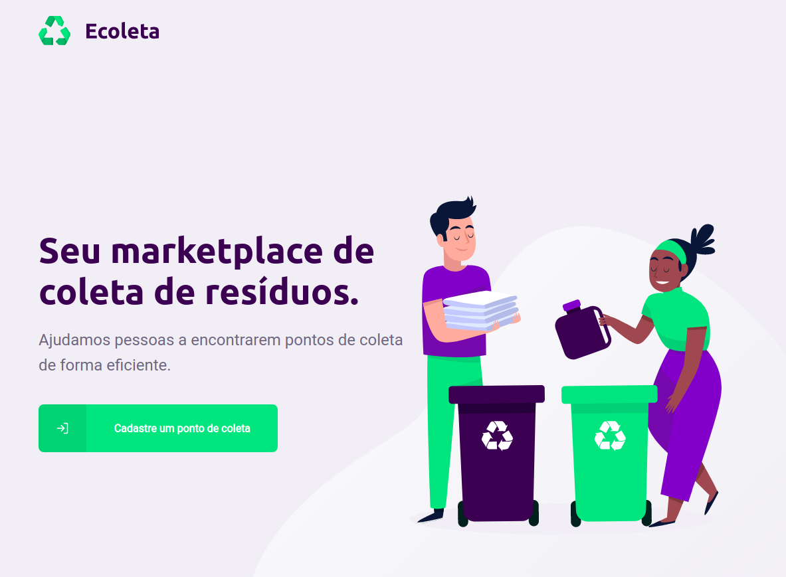

# :recycle: Ecoleta
Aplication to find recycling points to proper discard junk

---
## About
Ecoleta its a web/mobile aplication to map recycling points and helping people to find the near place to proper discard junk like eletronics pieces, bateries, lamps or paper.

 

---
## Goals

 

 

